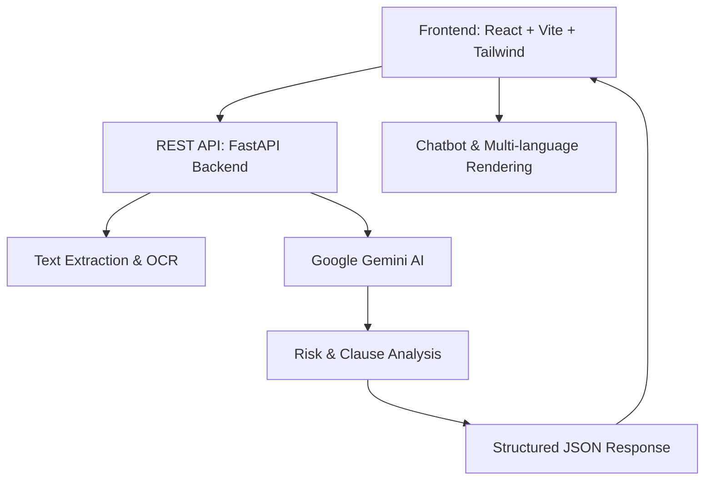

# 📑 LegalDoc AI – Intelligent Legal Document Analysis Platform

> **Empowering individuals and organizations by transforming complex legal documents into simple, actionable insights with the power of AI.**

---

## 🌍 Vision & Social Impact

Legal documents are often filled with jargon and complex clauses that make them inaccessible to non-experts. This creates barriers for individuals, small businesses, and communities when making informed decisions.

**LegalDoc AI** breaks these barriers by:

* Making legal content understandable to anyone — even a 10-year-old.
* Highlighting **risks, rights, and obligations** clearly.
* Supporting **multi-language output** so people can access legal insights in their native language.
* Democratizing access to legal knowledge, reducing dependency on expensive legal services.

This aligns directly with the **"AI for Accessibility & Inclusion"** focus area by ensuring **legal literacy for all**.

---

## 🎯 Problem We Solve

* **Complexity of Legal Jargon**: Most people cannot fully understand contracts, agreements, and policies.
* **Risk of Missing Key Details**: Hidden clauses or risks often go unnoticed.
* **Language Barriers**: Legal documents are usually in English, leaving non-English speakers excluded.

With **LegalDoc AI**, users can:
✅ Upload documents → ✅ Get simplified analysis → ✅ Receive risk assessment & key highlights → ✅ Ask real-time questions via chatbot.

---

## 🚀 Core Features

### 📄 Document Processing

* Upload in **PDF / TXT / raw text**.
* **Batch processing** for multiple files.
* Smart **OCR-based text extraction**.

### 🤖 AI-Powered Legal Analysis

* **Google Gemini AI** models (`gemini-2.5-flash`, `gemini-1.5-pro`).
* Clause-level **risk classification (High/Medium/Low)**.
* **Compliance & law citations** automatically included.
* **Persona-based analysis** (lawyer, paralegal, business user).

### 💬 AI Chatbot

* Context-aware Q\&A about uploaded documents.
* Provides **legal insights in real time**.

### 🌍 Multi-Language Support

* Output available in **8+ languages** (English, Hindi, Tamil, Telugu, Bengali, Gujarati, Marathi, Kannada).
* Real-time translation & localized legal terminology.

### 🎨 User Experience

* Clean, responsive **React + Tailwind** UI.
* Dark/Light themes, accessibility compliant.
* Smooth animations powered by Framer Motion.

---

## 🏗️ Architecture Overview



* **Frontend**: React 18 + TypeScript, Firebase Auth, Context API, Vite build.
* **Backend**: FastAPI server, Gemini AI integration, Tesseract OCR.
* **AI Models**: Google Gemini (NLP, clause analysis, translation).
* **Deployment**: Render (backend), Vercel/Netlify (frontend).
* **Security**: Firebase authentication + secure file handling.

---

## 🧑‍💻 Technical Implementation

### Frontend

* **Document viewer** with highlights & summaries.
* **Chatbot** interface for interactive analysis.
* **Job tracking** for real-time processing.

### Backend

* **Endpoints**:

  * `/health` → API status check.
  * `/analyze-legal-document` → File upload + analysis.
* **PDF OCR pipeline**: Extract → Clean → AI Analysis.
* **Stateless**: No sensitive data stored.

### Example Response

```json
{
  "clause": "Party agrees to pay liquidated damages of $10,000",
  "risk": "High",
  "laws": "Contract law principles; UCC Article 2",
  "summary": "This creates high risk due to financial exposure..."
}
```

---

## 🔑 Feasibility & Scalability

* Built using **Google Cloud AI tools** → ensures **scalable NLP & analysis**.
* Backend is **containerized (Docker)** → deployable on **any cloud**.
* **Language expansion** → can easily add more regional languages.
* **Market Viability**:

  * **Target users**: SMEs, startups, freelancers, students, NGOs.
  * **Adoption potential**: Wide, as legal literacy is a global need.

---

## 🧩 Functional Prototype

✅ Live deployed API: `https://genai-exchange-hackathon-2025.onrender.com/health`

✅ React-based frontend (with Gemini integration).

✅ Working features: document upload, AI analysis, chatbot, translation.

---

## 📽️ Demo Video

🎥 A **3-min demo video** (YouTube/Vimeo link) showcasing:

1. Uploading a legal doc.
2. AI-powered analysis with risk highlights.
3. Simplified summary in multiple languages.
4. Chatbot answering questions interactively.

---

## 📝 Testing Instructions

### Frontend

```bash
git clone <frontend-repo>
npm install
npm run dev
```

Visit: `http://localhost:5173`

### Backend

```bash
git clone <backend-repo>
pip install -r requirements.txt
uvicorn api:app --reload
```

API Docs: `http://localhost:8000/docs`
